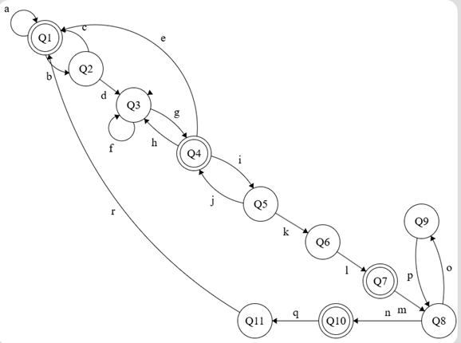
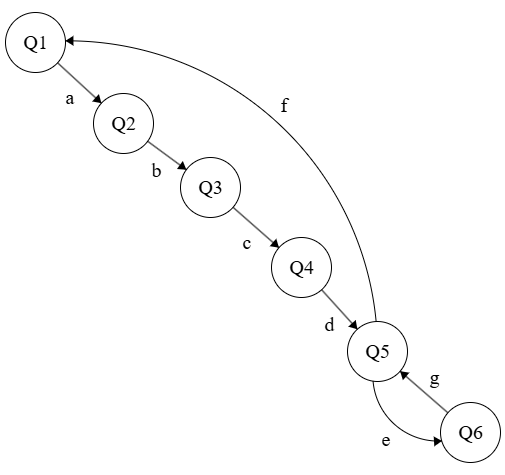

# Simulación de Máquinas de Estado – RoboCup@Home

Este repositorio contiene la simulación de máquinas de estado finito (FSM) para los retos de la liga RoboCup@Home, utilizando Python 3.13 como lenguaje base para emular el comportamiento de un robot de servicio. Cada FSM representa una tarea específica que el robot debe ejecutar durante la competencia.

---

## 🧠 FSM – Help Me Carry

Este reto simula la asistencia del robot para llevar una bolsa desde un vehículo hasta una ubicación de inicio, sorteando obstáculos y siguiendo instrucciones humanas. A continuación se describen los estados y sus respectivas transiciones:

### Estados y Transiciones

- **Q1** → `Identificando persona` (tecla `a`)
- **Q2** → `Persona identificada` (tecla `b`)
- **Q3** → `Persona camina` (tecla `c`)
- **Q4** → `Persona se detiene` (tecla `d`)
- **Q5** → `Se recibe indicación` (tecla `e`)
- **Q6** → `Identificar bolsa` (tecla `f`)
- **Q7** → `Recoger bolsa` (tecla `g`)
- **Q8** → `Regresar con bolsa` (tecla `h`)
- **Q9** → `Se detecta obstáculos` (tecla `i`)
- **Q10** → `Se evitan obstáculos` (tecla `j`)
- **Q11** → `Se detecta cosas pequeñas` (tecla `k`)
- **Q12** → `Entregar bolsa` (tecla `l`)
- **Q13** → `Regresando al estado inicial` (tecla `m`)

#### Transiciones adicionales:
`n`, `o`, `p`, `q`, `r`, `s`, `t`, `u`, `v`, `w`, `x`

### Diagrama FSM

---

## 🤖 FSM – General Purpose Service Robot

Este reto representa un robot multifuncional que puede ejecutar diferentes órdenes emitidas por un operador humano, desde reconocer obstáculos hasta entregar objetos y regresar al punto de instrucción.

### Estados y Transiciones

- **Q1** → `Se detecta obstáculo` (tecla `a` o `b`)
- **Q2** → `No se detecta obstáculo` (tecla `c` o `d`)
- **Q3** → `Quieto` (tecla `e` o `f`)
- **Q4** → `Se recibe orden` (tecla `g` o `h`)
- **Q5** → `Ejecutando orden` (tecla `i` o `z`)
- **Q6** → `Finalizando orden` (tecla `j` o `z`)
- **Q7** → `Punto de instrucción` (tecla `k`, `l` o `z`)

### Diagrama FSM

---

## 🗂 Estructura del Proyecto

